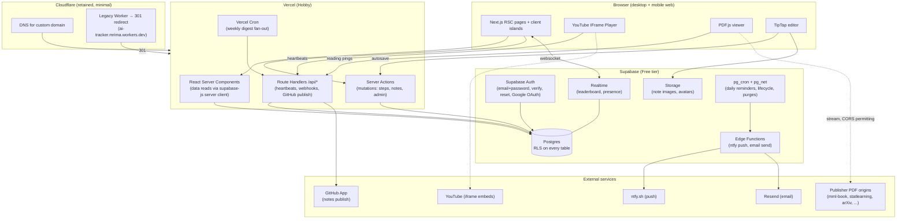
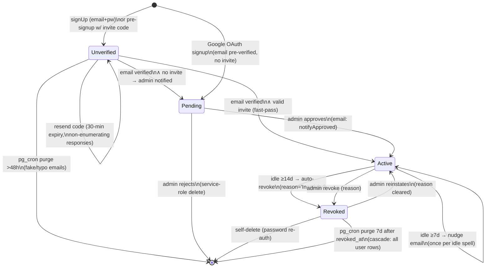

# Study OS v2 — Technical Architecture

**Status:** Draft for build · **Author:** solo dev · **Date:** 2026-07-27
**Supersedes:** v1 "AI Curriculum Tracker" (Cloudflare Worker + D1 + vanilla-JS SPA, live at `ai-tracker.mrima.workers.dev`, 7 active users)

---

## Table of Contents

1. [Executive summary, goals & non-goals](#1-executive-summary-goals--non-goals)
2. [System architecture, hosting topology, cost](#2-system-architecture-hosting-topology-cost)
3. [Postgres schema (DDL) with RLS](#3-postgres-schema-ddl-with-rls)
4. [API surface](#4-api-surface)
5. [Video-tracking design](#5-video-tracking-design)
6. [Notes editor + GitHub integration](#6-notes-editor--github-integration)
7. [Library & licensing per book](#7-library--licensing-per-book)
8. [Auth & lifecycle state machine](#8-auth--lifecycle-state-machine)
9. [Migration plan from v1](#9-migration-plan-from-v1)
10. [Build plan M0–M5](#10-build-plan-m0m5)
11. [What stays on Cloudflare and why](#11-what-stays-on-cloudflare-and-why)
12. [Portfolio framing](#12-portfolio-framing)

---

## 1. Executive summary, goals & non-goals

### What v2 is

Study OS v2 rebuilds the minimal study tracker into a **production learning platform** for a small cohort (7 real users today, capped at ~50) working through a 77-week AI-from-first-principles curriculum. v1 proved the habit loop (steps → streaks → leaderboard → daily ntfy push). v2 upgrades the three weakest links:

1. **Honesty of tracking** — v1 trusts a checkbox; v2 measures actual watch time (YouTube IFrame API heartbeats) and reading sessions, and auto-completes steps from evidence.
2. **Friction of studying** — v1 links out to YouTube/PDFs; v2 is a one-stop study room: embedded player, in-app PDF reading room for legally embeddable books/papers, rich notes with one-click GitHub publish.
3. **Operability** — curriculum moves from a 448-line TypeScript constant into versioned, admin-editable Postgres tables; auth moves from hand-rolled HMAC cookies + PBKDF2 to Supabase Auth; analytics become queryable.

### Architecture in one sentence

**Next.js 15 (App Router, RSC, TypeScript) on Vercel** for all UI and API; **Supabase** (Postgres + Auth + RLS + Realtime + Storage + pg_cron/Edge Functions) as the single stateful backend; **Cloudflare kept only where it earns its place** (DNS, the legacy Worker as a redirect shim during migration — see §11).

### Goals

- Everything in v1, re-implemented with equal or better security posture (v1 already has: invite fast-pass + admin approval, email verification, non-enumerating reset flow, encrypted PATs, inactivity lifecycle — none of that regresses).
- Real engagement telemetry: watch %, reading sessions, per-step evidence.
- Curriculum as versioned data with an admin editor.
- Server-persisted gamification (streaks/badges/momentum survive device changes).
- Zero-downtime migration for the 7 existing users.
- ~$0/month run cost on free tiers.

### Non-goals

- Mobile native apps (responsive web + ntfy push covers it).
- Rehosting copyrighted book PDFs (we embed/stream only from official publisher URLs, else link out — §7).
- Social features beyond the leaderboard (no comments/DMs/feeds).
- Multi-curriculum marketplace. Schema is curriculum-versioned so a second curriculum is *possible*, but no UI for it.
- Perfect anti-cheat. This is a 7-person accountability group, not a certification body; anti-abuse is "make casual cheating annoying," not adversarial-proof (§5.5).
- SSO/SAML, orgs, billing.

---

## 2. System architecture, hosting topology, cost

### 2.1 Diagram



### 2.2 Where each concern lives

| Concern | Home | Rationale |
|---|---|---|
| Pages, layouts, data reads | Next.js RSC on Vercel | Zero client JS for read paths; direct Postgres reads via server Supabase client with the user's JWT (RLS enforced) |
| Mutations | Server Actions | Typed, colocated, CSRF-protected by Next.js origin checks; Zod-validated at the boundary |
| High-frequency writes (video heartbeats) | Route Handlers | Actions add overhead per call; a POST endpoint with `sendBeacon` support fits better |
| Auth | Supabase Auth (`@supabase/ssr` cookie sessions) | Built-in email verification, password reset, OAuth; deletes ~400 lines of v1 hand-rolled auth |
| Authorization | Postgres RLS (+ re-checks in Actions for admin ops) | Defense in depth; even a leaked anon key can't cross user boundaries |
| Scheduled jobs | **Supabase pg_cron (primary)** + one Vercel cron | See below |
| Push | ntfy.sh (retained) | Users already subscribed to their per-user topics; free; no APNs/FCM setup |
| Email | **Resend** (replaces Gmail API) | See §6/§4 rationale; Gmail-API OAuth refresh-token plumbing dies |
| File storage | Supabase Storage | Note images, avatars; signed URLs, RLS-adjacent storage policies |

**Cron recommendation: Supabase `pg_cron` is the primary scheduler.** Justification:

- The jobs (daily reminder fan-out, inactivity nudge/revoke, purge unverified/revoked, streak snapshot, badge evaluation) are **data-shaped**: they are 90% SQL over user tables. Running them where the data lives means no cold-start, no network hop, no serverless duration limits, and they're testable as plain SQL.
- `pg_cron` + `pg_net` can call a Supabase Edge Function for the parts that need HTTP (ntfy POST, Resend API), keeping side effects out of the DB transaction.
- Vercel cron on Hobby allows limited daily invocations and jobs can hit function-duration limits; Cloudflare cron would keep a whole Worker deployment alive just for a scheduler.
- **One Vercel cron survives**: the weekly digest (Mondays), because it renders email HTML with React Email inside the Next.js app — that rendering belongs to the app codebase, not an Edge Function.

Schedule map:

| Job | Schedule | Runner |
|---|---|---|
| Daily study reminder → ntfy | `0 6 * * *` (per-user tz filter in SQL) | pg_cron → Edge Function |
| Inactivity nudge (7d) / auto-revoke (14d) | `30 6 * * *` | pg_cron (SQL) → Edge Function for emails |
| Purge unverified >48h, revoked >7d | `0 3 * * *` | pg_cron (pure SQL) |
| Streak/momentum snapshot, badge award pass | `15 3 * * *` | pg_cron (pure SQL) |
| Watch-session sweeper (close stale sessions) | `*/15 * * * *` | pg_cron (pure SQL) |
| Weekly digest email | `0 7 * * 1` | Vercel cron → route handler → Resend |

### 2.3 Cost estimate (monthly)

| Service | Tier | Usage @ ≤50 users | Cost |
|---|---|---|---|
| Vercel | Hobby | Personal project; well under 100GB bandwidth | $0 |
| Supabase | Free | <500MB DB (heartbeats aggregated, §5.4), <1GB storage, 50k MAU auth | $0 |
| Resend | Free | 3,000 emails/mo ≫ needed (~300/mo: verifications, digests, lifecycle) | $0 |
| ntfy.sh | Public server | Per-user random topics (as v1) | $0 |
| Cloudflare | Free | DNS + redirect shim Worker | $0 |
| GitHub App | Free | API within limits | $0 |
| Domain | — | Optional custom domain | ~$10/yr |

**Total: $0/mo** (+ optional domain). Growth watch-item: `watch_events` volume — mitigated by aggregating heartbeats into segments client-side and pruning raw events after 90 days (§5.4). Supabase free-tier pausing after 7 days of inactivity is a non-issue: daily pg_cron activity counts, and the daily reminder job guarantees traffic.

---

## 3. Postgres schema (DDL) with RLS

Conventions: `uuid` PKs referencing `auth.users(id)` for user rows; `timestamptz` everywhere; `snake_case`; every table has RLS enabled; admin = `profiles.role = 'admin'` checked via a `security definer` helper to avoid recursive RLS.

```sql
-- ============================================================
-- Extensions
-- ============================================================
create extension if not exists pg_cron;
create extension if not exists pg_net;

-- ============================================================
-- Helpers
-- ============================================================
create schema if not exists app;

-- Admin check. SECURITY DEFINER so RLS policies on profiles don't recurse.
create or replace function app.is_admin() returns boolean
language sql stable security definer set search_path = public as $$
  select exists (
    select 1 from public.profiles
    where id = auth.uid() and role = 'admin'
  );
$$;

-- Active-member check (revoked/pending users lose data access app-wide).
create or replace function app.is_active_member() returns boolean
language sql stable security definer set search_path = public as $$
  select exists (
    select 1 from public.profiles
    where id = auth.uid() and status = 'active'
  );
$$;

-- ============================================================
-- 1. Identity & lifecycle
-- ============================================================

-- Mirrors auth.users 1:1. Created by an on-signup trigger.
create table public.profiles (
  id            uuid primary key references auth.users(id) on delete cascade,
  display_name  text not null check (display_name ~ '^[\w .-]{2,24}$'),
  role          text not null default 'member' check (role in ('member','admin')),
  status        text not null default 'pending'
                check (status in ('pending','active','revoked')),
  -- lifecycle bookkeeping (maps v1 revoke_reason / revoked_at / last_nudge_at)
  revoke_reason text,
  revoked_at    timestamptz,
  last_nudge_at timestamptz,
  joined_via_invite boolean not null default false,
  timezone      text not null default 'Africa/Nairobi',
  avatar_url    text,
  created_at    timestamptz not null default now(),
  updated_at    timestamptz not null default now(),
  unique (display_name)
);
alter table public.profiles enable row level security;

-- Everyone active can see minimal profile info (leaderboard needs names).
create policy "profiles: active members read all"
  on public.profiles for select
  using (app.is_active_member() or id = auth.uid() or app.is_admin());
create policy "profiles: self update (safe cols enforced by trigger)"
  on public.profiles for update
  using (id = auth.uid()) with check (id = auth.uid());
create policy "profiles: admin update"
  on public.profiles for update using (app.is_admin());
-- No client INSERT/DELETE: signup trigger inserts; deletes cascade from auth.users
-- via service-role admin API only.

-- Column-level guard: members cannot self-promote or self-activate.
create or replace function app.guard_profile_update() returns trigger
language plpgsql as $$
begin
  if not app.is_admin() then
    if new.role <> old.role or new.status <> old.status
       or coalesce(new.revoke_reason,'') <> coalesce(old.revoke_reason,'') then
      raise exception 'not allowed';
    end if;
  end if;
  new.updated_at := now();
  return new;
end $$;
create trigger trg_guard_profile before update on public.profiles
  for each row execute function app.guard_profile_update();

-- Invite codes (replaces single env INVITE_CODE; keeps fast-pass semantics).
create table public.invites (
  id          uuid primary key default gen_random_uuid(),
  code        text not null unique,          -- store as-is; codes are low-value
  max_uses    int  not null default 10,
  used_count  int  not null default 0,
  expires_at  timestamptz,
  created_by  uuid references public.profiles(id),
  created_at  timestamptz not null default now()
);
alter table public.invites enable row level security;
create policy "invites: admin all" on public.invites for all
  using (app.is_admin()) with check (app.is_admin());
-- Redemption happens server-side (service role / security definer fn), so no
-- anon SELECT policy: codes are never enumerable from the client.

-- Redemption + approval audit (who used which code, who approved whom).
create table public.membership_events (
  id         bigint generated always as identity primary key,
  user_id    uuid not null references public.profiles(id) on delete cascade,
  event      text not null check (event in
             ('signup','email_verified','invite_redeemed','approved',
              'revoked','reinstated','nudged','purge_scheduled')),
  actor_id   uuid references public.profiles(id),  -- null = system
  detail     jsonb not null default '{}',
  created_at timestamptz not null default now()
);
alter table public.membership_events enable row level security;
create policy "membership_events: self read" on public.membership_events
  for select using (user_id = auth.uid() or app.is_admin());
-- inserts via triggers / service role only

-- ============================================================
-- 2. Curriculum as data (versioned, admin-editable)
-- ============================================================

create table public.curriculum_versions (
  id          int generated always as identity primary key,
  label       text not null,                  -- 'v1-import', '2026-08 revision'
  status      text not null default 'draft' check (status in ('draft','published','archived')),
  published_at timestamptz,
  created_at  timestamptz not null default now()
);

create table public.weeks (
  id           bigint generated always as identity primary key,
  version_id   int not null references public.curriculum_versions(id) on delete cascade,
  slug         text not null,                 -- 'week01', 'week08r' (v1 ids preserved)
  position     int not null,                  -- ordering
  phase        text not null,                 -- 'Phase 1 — Math'
  title        text not null,
  is_recap     boolean not null default false,
  unique (version_id, slug),
  unique (version_id, position)
);

-- A resource is an embeddable/linkable learning object shared across steps.
create table public.resources (
  id           bigint generated always as identity primary key,
  kind         text not null check (kind in ('youtube','book','book_chapter','paper','repo','article')),
  title        text not null,
  url          text not null,                 -- canonical public URL
  youtube_id   text,                          -- extracted for kind='youtube'
  duration_seconds int,                       -- video runtime / est. reading time
  embed_mode   text not null default 'link_out'
               check (embed_mode in ('iframe','pdfjs','link_out')),  -- §7 decisions
  pdf_url      text,                          -- official streamable PDF when pdfjs
  page_count   int,
  license_note text,                          -- human note from §7 audit
  meta         jsonb not null default '{}',
  unique (kind, url)
);

create table public.steps (
  id           bigint generated always as identity primary key,
  week_id      bigint not null references public.weeks(id) on delete cascade,
  position     int not null,
  slug         text not null,                 -- 'week01.0' style, preserved from v1 for migration
  title        text not null,
  kind         text not null check (kind in
               ('setup','watch','read','build','exercise','checkpoint','note','paper','project')),
  est_minutes  int not null check (est_minutes > 0),
  resource_id  bigint references public.resources(id),
  auto_complete_rule jsonb,   -- e.g. {"type":"watch_pct","threshold":0.9}
                              --      {"type":"note_published"}
  unique (week_id, position),
  unique (week_id, slug)
);

create table public.guides (
  week_id   bigint primary key references public.weeks(id) on delete cascade,
  why       text not null,
  remember  text[] not null default '{}'
);

-- Read-only to all authenticated active members; writable by admin.
alter table public.curriculum_versions enable row level security;
alter table public.weeks     enable row level security;
alter table public.resources enable row level security;
alter table public.steps     enable row level security;
alter table public.guides    enable row level security;

create policy "curriculum: members read published" on public.curriculum_versions
  for select using (status = 'published' or app.is_admin());
create policy "curriculum: admin write" on public.curriculum_versions
  for all using (app.is_admin()) with check (app.is_admin());
-- (repeat the same read/write pair for weeks, resources, steps, guides;
--  weeks/steps read-policies additionally join to a published version:)
create policy "weeks: members read" on public.weeks for select
  using (app.is_active_member() and exists (
     select 1 from public.curriculum_versions v
     where v.id = version_id and v.status = 'published')
   or app.is_admin());
create policy "weeks: admin write" on public.weeks for all
  using (app.is_admin()) with check (app.is_admin());
create policy "steps: members read" on public.steps for select
  using (app.is_active_member() or app.is_admin());
create policy "steps: admin write" on public.steps for all
  using (app.is_admin()) with check (app.is_admin());
create policy "resources: members read" on public.resources for select
  using (app.is_active_member() or app.is_admin());
create policy "resources: admin write" on public.resources for all
  using (app.is_admin()) with check (app.is_admin());
create policy "guides: members read" on public.guides for select
  using (app.is_active_member() or app.is_admin());
create policy "guides: admin write" on public.guides for all
  using (app.is_admin()) with check (app.is_admin());

-- ============================================================
-- 3. Progress
-- ============================================================

create table public.step_progress (
  user_id      uuid not null references public.profiles(id) on delete cascade,
  step_id      bigint not null references public.steps(id) on delete cascade,
  status       text not null default 'done' check (status in ('done','skipped')),
  completed_at timestamptz not null default now(),
  source       text not null default 'manual'
               check (source in ('manual','auto_watch','auto_read','auto_note')),
  primary key (user_id, step_id)
);
alter table public.step_progress enable row level security;
create policy "step_progress: self all" on public.step_progress
  for all using (user_id = auth.uid()) with check (user_id = auth.uid());
create policy "step_progress: leaderboard aggregate read" on public.step_progress
  for select using (app.is_active_member());  -- names+counts are public in-group (v1 parity)
create policy "step_progress: admin read" on public.step_progress
  for select using (app.is_admin());

-- User settings (typed columns replace v1's KV table)
create table public.user_settings (
  user_id          uuid primary key references public.profiles(id) on delete cascade,
  start_date       date not null default current_date,
  session_minutes  int  not null default 120 check (session_minutes between 30 and 480),
  study_days       int[] not null default '{1,2,3,4,5,6}',  -- 0=Sun..6=Sat
  reminder_enabled boolean not null default true,
  ntfy_topic       text,          -- server-generated random topic (v1 parity)
  ntfy_server      text,
  onboarded        boolean not null default false,
  updated_at       timestamptz not null default now()
);
alter table public.user_settings enable row level security;
create policy "user_settings: self all" on public.user_settings
  for all using (user_id = auth.uid()) with check (user_id = auth.uid());
create policy "user_settings: admin read" on public.user_settings
  for select using (app.is_admin());

-- ============================================================
-- 4. Video watch tracking (§5)
-- ============================================================

create table public.watch_sessions (
  id            uuid primary key default gen_random_uuid(),
  user_id       uuid not null references public.profiles(id) on delete cascade,
  resource_id   bigint not null references public.resources(id) on delete cascade,
  step_id       bigint references public.steps(id) on delete set null,
  started_at    timestamptz not null default now(),
  ended_at      timestamptz,           -- set on 'ended' event or by sweeper
  client_meta   jsonb not null default '{}'  -- ua hash, viewport; no PII
);
alter table public.watch_sessions enable row level security;
create policy "watch_sessions: self all" on public.watch_sessions
  for all using (user_id = auth.uid()) with check (user_id = auth.uid());
create policy "watch_sessions: admin read" on public.watch_sessions
  for select using (app.is_admin());

-- Coalesced watched intervals, in *video seconds* (not wall clock).
create table public.watch_segments (
  id           bigint generated always as identity primary key,
  session_id   uuid not null references public.watch_sessions(id) on delete cascade,
  user_id      uuid not null references public.profiles(id) on delete cascade,
  resource_id  bigint not null references public.resources(id) on delete cascade,
  start_s      real not null check (start_s >= 0),
  end_s        real not null check (end_s > start_s),
  max_rate     real not null default 1.0,     -- highest playback rate seen in segment
  visible      boolean not null default true, -- tab visible for majority of segment
  created_at   timestamptz not null default now()
);
create index on public.watch_segments (user_id, resource_id);
alter table public.watch_segments enable row level security;
create policy "watch_segments: self insert/read" on public.watch_segments
  for all using (user_id = auth.uid()) with check (user_id = auth.uid());
create policy "watch_segments: admin read" on public.watch_segments
  for select using (app.is_admin());

-- Rolled-up per-user-per-video progress (maintained by trigger on segments).
create table public.resource_progress (
  user_id        uuid not null references public.profiles(id) on delete cascade,
  resource_id    bigint not null references public.resources(id) on delete cascade,
  seconds_watched real not null default 0,    -- union of credited segments
  pct            real not null default 0,     -- seconds_watched / duration
  completed_at   timestamptz,                 -- when pct crossed threshold
  last_position_s real not null default 0,    -- resume point
  updated_at     timestamptz not null default now(),
  primary key (user_id, resource_id)
);
alter table public.resource_progress enable row level security;
create policy "resource_progress: self all" on public.resource_progress
  for all using (user_id = auth.uid()) with check (user_id = auth.uid());
create policy "resource_progress: admin read" on public.resource_progress
  for select using (app.is_admin());

-- ============================================================
-- 5. Reading tracking (books & papers, §7)
-- ============================================================

create table public.reading_sessions (
  id           uuid primary key default gen_random_uuid(),
  user_id      uuid not null references public.profiles(id) on delete cascade,
  resource_id  bigint not null references public.resources(id) on delete cascade,
  started_at   timestamptz not null default now(),
  ended_at     timestamptz,
  seconds_active int not null default 0,      -- visibility-gated active time
  pages_seen   int[] not null default '{}'    -- distinct page numbers this session
);
alter table public.reading_sessions enable row level security;
create policy "reading_sessions: self all" on public.reading_sessions
  for all using (user_id = auth.uid()) with check (user_id = auth.uid());
create policy "reading_sessions: admin read" on public.reading_sessions
  for select using (app.is_admin());

create table public.reading_progress (
  user_id      uuid not null references public.profiles(id) on delete cascade,
  resource_id  bigint not null references public.resources(id) on delete cascade,
  pages_read   int not null default 0,        -- distinct pages, all sessions
  pct          real not null default 0,
  last_page    int not null default 1,
  updated_at   timestamptz not null default now(),
  primary key (user_id, resource_id)
);
alter table public.reading_progress enable row level security;
create policy "reading_progress: self all" on public.reading_progress
  for all using (user_id = auth.uid()) with check (user_id = auth.uid());
create policy "reading_progress: admin read" on public.reading_progress
  for select using (app.is_admin());

-- ============================================================
-- 6. Notes (§6)
-- ============================================================

create table public.notes (
  id           uuid primary key default gen_random_uuid(),
  user_id      uuid not null references public.profiles(id) on delete cascade,
  week_id      bigint not null references public.weeks(id) on delete cascade,
  content      jsonb not null,                -- TipTap doc JSON (source of truth)
  content_md   text not null default '',      -- derived markdown (for GitHub push/search)
  updated_at   timestamptz not null default now(),
  published_sha text,                         -- last GitHub commit sha
  published_at timestamptz,
  unique (user_id, week_id)
);
alter table public.notes enable row level security;
create policy "notes: self all" on public.notes
  for all using (user_id = auth.uid()) with check (user_id = auth.uid());
-- Notes are PRIVATE: no member-wide read, no admin read of content.

create table public.note_versions (
  id         bigint generated always as identity primary key,
  note_id    uuid not null references public.notes(id) on delete cascade,
  user_id    uuid not null references public.profiles(id) on delete cascade,
  content    jsonb not null,
  content_md text not null,
  saved_at   timestamptz not null default now(),
  cause      text not null default 'autosave' check (cause in ('autosave','manual','publish'))
);
create index on public.note_versions (note_id, saved_at desc);
alter table public.note_versions enable row level security;
create policy "note_versions: self all" on public.note_versions
  for all using (user_id = auth.uid()) with check (user_id = auth.uid());

-- GitHub connection (per user; App installation preferred, PAT fallback §6.3)
create table public.github_connections (
  user_id         uuid primary key references public.profiles(id) on delete cascade,
  mode            text not null check (mode in ('app','pat')),
  installation_id bigint,          -- GitHub App installation
  pat_ciphertext  text,            -- AES-GCM via pgsodium/Vault, only when mode='pat'
  owner           text not null,
  repo            text not null,
  branch          text not null default 'main',
  updated_at      timestamptz not null default now()
);
alter table public.github_connections enable row level security;
create policy "github_connections: self all" on public.github_connections
  for all using (user_id = auth.uid()) with check (user_id = auth.uid());
-- pat_ciphertext is additionally excluded from client reads via a view; raw
-- table is only touched by server-side code with service role.

-- ============================================================
-- 7. Gamification (§ server-side, persisted)
-- ============================================================

create table public.streaks (
  user_id        uuid primary key references public.profiles(id) on delete cascade,
  current_streak int not null default 0,
  longest_streak int not null default 0,
  momentum       real not null default 0,     -- EWMA of daily minutes, decays
  last_active_on date,
  updated_at     timestamptz not null default now()
);
alter table public.streaks enable row level security;
create policy "streaks: members read" on public.streaks
  for select using (app.is_active_member() or app.is_admin());
-- writes only via pg_cron job / triggers (service context)

create table public.badges (
  id          text primary key,               -- 'first-week', 'streak-30', 'gpt-built'
  title       text not null,
  description text not null,
  icon        text not null,
  rule        jsonb not null                  -- declarative predicate evaluated nightly
);
alter table public.badges enable row level security;
create policy "badges: members read" on public.badges
  for select using (app.is_active_member() or app.is_admin());
create policy "badges: admin write" on public.badges
  for all using (app.is_admin()) with check (app.is_admin());

create table public.badge_awards (
  user_id    uuid not null references public.profiles(id) on delete cascade,
  badge_id   text not null references public.badges(id) on delete cascade,
  awarded_at timestamptz not null default now(),
  primary key (user_id, badge_id)
);
alter table public.badge_awards enable row level security;
create policy "badge_awards: members read" on public.badge_awards
  for select using (app.is_active_member() or app.is_admin());

create table public.focus_sessions (         -- pomodoro / session timer
  id          uuid primary key default gen_random_uuid(),
  user_id     uuid not null references public.profiles(id) on delete cascade,
  started_at  timestamptz not null default now(),
  ended_at    timestamptz,
  target_minutes int not null default 25,
  completed   boolean not null default false,
  step_id     bigint references public.steps(id) on delete set null
);
alter table public.focus_sessions enable row level security;
create policy "focus_sessions: self all" on public.focus_sessions
  for all using (user_id = auth.uid()) with check (user_id = auth.uid());

-- Leaderboard: a VIEW over step_progress/streaks so it is always
-- server-computed (v1 lesson kept). Realtime clients subscribe to
-- step_progress/streaks changes and re-fetch the view.
create or replace view public.leaderboard as
  select p.id, p.display_name, p.avatar_url,
         count(sp.step_id)                                   as done_steps,
         count(sp.step_id) filter
           (where sp.completed_at > now() - interval '7 days') as week_steps,
         coalesce(s.current_streak, 0)                        as streak,
         coalesce(s.momentum, 0)                              as momentum
  from public.profiles p
  left join public.step_progress sp on sp.user_id = p.id
  left join public.streaks s        on s.user_id = p.id
  where p.status = 'active'
  group by p.id, p.display_name, p.avatar_url, s.current_streak, s.momentum;
-- view runs with invoker rights; underlying RLS policies gate it.

-- ============================================================
-- 8. Notifications & audit
-- ============================================================

create table public.notification_log (
  id         bigint generated always as identity primary key,
  user_id    uuid references public.profiles(id) on delete set null,
  channel    text not null check (channel in ('email','ntfy')),
  template   text not null,     -- 'verify','reset','approved','revoked','nudge','digest','daily'
  status     text not null check (status in ('sent','failed','skipped')),
  detail     jsonb not null default '{}',
  created_at timestamptz not null default now()
);
alter table public.notification_log enable row level security;
create policy "notification_log: admin read" on public.notification_log
  for select using (app.is_admin());

create table public.admin_audit (
  id         bigint generated always as identity primary key,
  actor_id   uuid not null references public.profiles(id),
  action     text not null,     -- 'user.revoke','curriculum.publish','step.edit',...
  target     jsonb not null default '{}',
  created_at timestamptz not null default now()
);
alter table public.admin_audit enable row level security;
create policy "admin_audit: admin read" on public.admin_audit
  for select using (app.is_admin());
```

**Storage buckets** (Supabase Storage policies, sketched):

- `note-images` — path `note-images/{user_id}/...`; insert/select where `auth.uid()::text = (storage.foldername(name))[1]`; public read *off*, served via signed URLs embedded in notes.
- `avatars` — same pattern; public read on.

**Design notes**

- **RLS everywhere + server re-checks**: every Server Action that does admin work re-validates `app.is_admin()` result server-side; RLS is the backstop, not the only wall.
- v1's `user_settings` KV becomes typed columns — the untyped KV pattern was a v1 expedience, not a feature.
- `steps.slug` preserves v1 step IDs (`week01.0`) so migration of `user_steps` is a pure join (§9).
- `auto_complete_rule` is data, not code: the watch pipeline reads it, so the admin can tune thresholds per step without deploys.

---

## 4. API surface

Split rule: **reads → RSC** (no API round trip), **user mutations → Server Actions**, **high-frequency / beacon / webhook traffic → Route Handlers**. All inputs validated with Zod. All responses from route handlers use the envelope `{ success, data, error, meta? }`.

### 4.1 Server Actions (Zod-validated, session from `@supabase/ssr` cookies)

| Action | Auth | Notes |
|---|---|---|
| `toggleStep(stepSlug, done)` | active member | Writes `step_progress`; source `'manual'`; recomputes streak row inline |
| `updateSettings(patch)` | active member | Typed columns; ntfy topic regeneration guarded server-side |
| `saveNote(weekSlug, tiptapJson)` | active member | Upserts `notes`, derives `content_md`, snapshots `note_versions` (debounced: ≤1 version / 5 min) |
| `publishNoteToGitHub(weekSlug)` | active member | §6.3; marks `note` step done via `auto_complete_rule` |
| `connectGitHub(config)` | active member | Stores App installation id, or PAT via server-side encryption |
| `startFocusSession(target, stepSlug?)` / `endFocusSession(id)` | active member | Pomodoro persistence |
| `requestAccountDeletion(password)` | any authed | Re-auth via `signInWithPassword` then service-role `auth.admin.deleteUser` (cascades) |
| `admin.setUserStatus(userId, status, reason?)` | admin | Lifecycle transitions (§8), writes `membership_events` + `admin_audit`, triggers email |
| `admin.deleteUser(userId)` | admin | Service-role delete; blocked for self |
| `admin.createInvite(maxUses, expiresAt)` / `admin.revokeInvite(id)` | admin | |
| `admin.upsertWeek / upsertStep / upsertResource / upsertGuide` | admin | Edits target a **draft** curriculum version |
| `admin.publishCurriculumVersion(versionId)` | admin | Draft → published; previous published → archived (transactional) |

### 4.2 Route Handlers

| Route | Method | Auth | Purpose |
|---|---|---|---|
| `/api/watch/session` | POST | active member | Open a `watch_session` → `{sessionId}` |
| `/api/watch/heartbeat` | POST | active member | Batched segments (§5.2); accepts `sendBeacon`; rate-limited 1/10s/session |
| `/api/watch/close` | POST | active member | Close session (also `sendBeacon` on unload) |
| `/api/read/session` · `/api/read/heartbeat` | POST | active member | Reading-room equivalent (page numbers + active seconds) |
| `/api/notes/[week]/versions` | GET | owner | Version-history list (paginated) |
| `/api/github/oauth/callback` | GET | state-checked | GitHub App installation callback |
| `/api/pdf-proxy` *(only if a publisher blocks CORS but permits linking — default off; §7)* | GET | active member | Strict allow-list streaming proxy; no caching of body |
| `/api/cron/digest` | POST | `CRON_SECRET` header | Vercel cron → weekly digest via Resend |
| `/api/admin/analytics` | GET | admin | DAU, watch hours, step velocity time series (SQL views) |

### 4.3 Auth endpoints

Supabase Auth hosts the primitives (signup, email verification, password reset, optional Google OAuth). App-level glue:

- `POST /api/auth/pre-signup` — public, rate-limited: validates display name uniqueness + invite code **server-side with service role** (invites have no anon RLS read), then calls `supabase.auth.signUp` with `data: { display_name, invite_id }`. A DB trigger on `auth.users` insert creates the `profiles` row with `status = 'pending'` and `joined_via_invite` per invite validity.
- Email-verification completion fires a trigger: `joined_via_invite → status='active'` (fast-pass); else stays `pending` + admin notified (Edge Function via `pg_net`).
- Google OAuth signups always land `pending` (no invite attached) unless the email matches a pre-approved invite email.

**Email provider recommendation: Resend.** The v1 Gmail-API path requires a Google Cloud OAuth client, refresh-token rotation, and ~100 lines of JWT/token exchange in the worker — all to send from a personal Gmail with tight sending limits and spam-folder risk. Resend on Vercel is one API key + React Email templates in-repo, 3k free emails/month, real DKIM/SPF on a custom domain. Supabase Auth's own emails (verify/reset) are pointed at Resend via SMTP settings so *all* mail leaves from one domain. Gmail API is retired.

---

## 5. Video-tracking design

### 5.1 Player integration

Each `watch` step renders an in-app player page: YouTube IFrame Player API (`enablejsapi=1`, `origin` pinned to the app domain). The wrapper component:

- restores `resource_progress.last_position_s` on load ("resume at 7:42?"),
- subscribes to `onStateChange` and `onPlaybackRateChange`,
- samples `getCurrentTime()` on an interval while `PLAYING`,
- listens to `visibilitychange` / `blur` to tag segments.

### 5.2 Heartbeat protocol

Client-side segment builder (keeps the server write rate tiny):

1. On `PLAYING`, sample `currentTime` every **5 s** into an open segment `{start_s, end_s, max_rate, visible}`.
2. A segment **closes** when: a seek is detected (`|Δt − elapsed·rate| > 2 s`), state leaves `PLAYING`, rate changes, visibility changes, or the segment reaches 60 s of video time.
3. Closed segments are queued and **flushed in batches every 30 s** to `POST /api/watch/heartbeat`; on `pagehide`/unload, flush via `navigator.sendBeacon` and `POST /api/watch/close`.

Payload:

```jsonc
{
  "sessionId": "…uuid…",
  "segments": [
    { "start": 312.0, "end": 371.5, "rate": 1.25, "visible": true },
    { "start": 371.5, "end": 380.0, "rate": 2.0,  "visible": false }
  ]
}
```

Server validation per segment: session belongs to caller and is open; `0 ≤ start < end ≤ duration + 5`; segment video-length ≤ (wall-clock since last flush) × max_rate × 1.25 slack (rejects fabricated hour-long segments); at most 40 segments per flush.

### 5.3 Completion computation

A trigger (or the flush handler) recomputes `resource_progress`:

- **Credited seconds** = length of the *union* of segment intervals where `rate ≤ 2.0` **and** `visible = true`. Union means re-watching a section never double-counts; skipping leaves holes.
- `pct = credited / duration_seconds`.
- When `pct ≥ threshold` (default **0.90**, from `steps.auto_complete_rule`), and the step isn't done: insert `step_progress (source='auto_watch')`, notify the client over Realtime → confetti + "step completed" toast. Manual checkbox still exists (watched elsewhere / rewatched) — auto-complete is additive, never removes a manual completion.

### 5.4 Storage economics

Raw 5 s samples never leave the browser; only coalesced segments do. Expected volume: a 3-hour Karpathy lecture ≈ 200–400 segment rows, ~30 KB. `watch_segments` older than 90 days are folded into `resource_progress` totals and deleted by a pg_cron job; `watch_sessions` rows are kept (small) for analytics. Well inside the 500 MB free tier.

### 5.5 Anti-abuse basics (honest-effort, not adversarial-proof)

| Vector | Mitigation |
|---|---|
| Tab in background while "watching" | `visible=false` segments earn no credit (Page Visibility API + iframe focus heuristics) |
| 16× speed scrubbing | Credit only `rate ≤ 2.0`; `max_rate` stored for audit |
| Replaying one minute in a loop | Interval-union: repeated ranges count once |
| Forged heartbeat POSTs | Segments bounded by wall-clock × rate (§5.2); per-session server-side monotonic wall-clock ledger; RLS pins rows to `auth.uid()` |
| Two videos at once | One open session per user enforced at `/api/watch/session` (auto-closes the previous) |
| Ghost sessions (crash/close) | pg_cron sweeper closes sessions with no flush for 15 min |

Explicit non-goal: a determined user can still script the API. Leaderboard is social pressure among 7 friends; the admin analytics view surfaces anomalies (e.g., watch-hours ≫ wall-clock hours) rather than trying to make them impossible.

---

## 6. Notes editor + GitHub integration

### 6.1 Editor

TipTap (ProseMirror) with StarterKit + extensions: `CodeBlockLowlight` (highlight.js), `Markdown` (paste/serialize), slash-command menu, `Image` with paste/drop upload, task lists, math (`katex` inline for derivations — this is an AI curriculum). Notes remain **per-week**, seeded from v1's template (`Learned / Confused by / Built / Next`).

- **Source of truth**: TipTap JSON in `notes.content`. `content_md` is derived on save via `prosemirror-markdown`, used for GitHub publishing and full-text search (`tsvector` index later if wanted).
- **Autosave**: client debounce 800 ms → `saveNote` action; version snapshot at most once per 5 min of edits plus on every publish. Version history UI = list + read-only render + "restore".
- **Images**: paste → upload to `note-images/{uid}/{noteId}/{hash}.png` → insert signed-URL. On GitHub publish, images are committed alongside the note under `notes/assets/` so the repo is self-contained.

### 6.2 Publish flow (kept from v1, upgraded)

"Publish to GitHub" commits `notes/{week-slug}.md` (+ assets) to the user's own repo via the Contents API, records `published_sha`, and completes the week's `note` step (`source='auto_note'`). Commit message format preserved: `notes(week02): update learning note`.

### 6.3 GitHub App vs PATs — **recommendation: GitHub App, PAT fallback**

| | GitHub App (recommended) | PAT (v1 status quo) |
|---|---|---|
| User setup | 2-click install on one repo | Generate token, choose scopes, paste — the #1 v1 support burden |
| Blast radius | Repo-scoped, `contents:write` only | Users routinely over-scope classic PATs |
| Expiry | Installation tokens minted per-request (1 h) from the App private key | Fine-grained PATs expire and silently break sync |
| Storage burden | Only `installation_id` (non-secret) in DB | AES-encrypted secret at rest (v1 carries this liability) |
| Revocation | User uninstalls the App; instant | User must remember the token exists |

Implementation: register a GitHub App (`contents: write` on selected repos), store the App private key in Vercel env, mint installation tokens server-side per publish. Keep a PAT path (`mode='pat'`, ciphertext via Supabase Vault/pgsodium, decrypted only server-side) for users who prefer it — it also derisks migration since v1 users already have PATs; they're re-entered post-migration, never bulk-copied (§9).

---

## 7. Library & licensing approach per book

Principles: **(a) never rehost copyrighted PDFs** in our storage/CDN; **(b) embed only official publisher URLs**, streaming into PDF.js when the origin's CORS headers allow cross-origin fetch; **(c) otherwise link out in a new tab** and track reading via a lightweight "reading timer" panel instead of page telemetry. Permissions verified 2026-07-27 against publisher sites:

| Book | Official free source (verified) | License / stated terms | v2 `embed_mode` |
|---|---|---|---|
| **MML** (Deisenroth, Faisal, Ong) | `https://mml-book.github.io/` → `mml-book.com/book/mml-book.pdf` | Authors state "We will keep PDFs of this book freely available"; © CUP, no explicit redistribution license → stream from *their* URL only | `pdfjs` if CORS allows at runtime, else `link_out` (feature-detected, see below) |
| **ISLR / ISLP** (James et al.) | `https://www.statlearning.com/` → PDFs hosted at `hastie.su.domains` (ISLRv2, ISLP) | Free author-hosted PDFs; no explicit license → same rule: official URL only | `pdfjs` w/ CORS probe, else `link_out` |
| **Nielsen, Neural Networks and Deep Learning** | `http://neuralnetworksanddeeplearning.com/` (HTML book) | **CC BY-NC 3.0** — explicit | `iframe`-hostile (site is plain HTML, embeds fine in new tab); treat as `link_out` chapters; CC-NC would even permit mirroring, but linking the living site is more correct (errata) |
| **d2l.ai** (Dive into Deep Learning) | `https://d2l.ai/` (HTML + official PDF) | Open book, source on GitHub (CC-BY-SA for text; code Apache-2.0 — per repo) | Chapters render beautifully as HTML → `link_out` per-chapter deep links; official PDF via `pdfjs` optional |
| **SLP3** (Jurafsky & Martin) | `https://web.stanford.edu/~jurafsky/slp3/` — full-book PDF + per-chapter PDFs (Jan 2026 draft) | Authors: "Feel free to use the draft chapters and slides in your classes"; no redistribution license → official URLs only | `pdfjs` per-chapter (chapter PDFs are small, great fit), CORS probe, else `link_out` |
| **Sutton & Barto, RL: An Introduction 2e** | `http://incompleteideas.net/book/the-book-2nd.html` → `RLbook2020.pdf` | Author-hosted full PDF; © MIT Press, no explicit license → official URL only | `pdfjs` w/ CORS probe, else `link_out` |
| **Fleuret, The Little Book of Deep Learning** | `https://fleuret.org/francois/lbdl.html` → `fleuret.org/public/lbdl.pdf` | **CC BY-NC-SA (explicit non-commercial CC)** | `pdfjs` — license is friendliest of the set; still stream from fleuret.org |
| **Papers (arXiv)** | `arxiv.org/pdf/<id>` (e.g., 1706.03762, 2203.02155, 2305.18290) | arXiv grants a distribution license; hotlinking the abstract/PDF is standard and arXiv serves permissive CORS on PDFs | `pdfjs` |

**Runtime CORS probe, not compile-time guesswork.** For every `pdfjs` resource the reading room first attempts `fetch(pdf_url, {method:'HEAD', mode:'cors'})`; on failure it degrades to a styled `link_out` card ("Opens at the publisher ↗") plus the reading-timer panel. Result cached in `resources.meta.cors_ok` per browser session. This keeps us correct even when publishers change headers, and means we ship no proxy by default. The optional `/api/pdf-proxy` (allow-list of the 8 origins above, streaming, `Cache-Control: no-store`) exists behind a flag but is **off** — it is legally grayer (it re-serves the bytes), so it is only to be enabled per-title if an author's site permits and CORS alone blocks a clearly-free book (e.g., Fleuret's CC-licensed PDF).

**Reading tracking** (both modes): PDF.js mode reports `{page numbers seen, active seconds}` on the same session/heartbeat pattern as video (§5.2, visibility-gated). Link-out mode shows an in-app timer panel ("I'm reading — start session") persisting `reading_sessions.seconds_active` only. `read`/`paper` steps auto-complete on rule `{"type":"read_pct","threshold":0.8}` (pdfjs) or manual check (link_out).

---

## 8. Auth & lifecycle state machine

Supabase Auth owns credential states (unverified email, verified, OAuth-linked). The **membership lifecycle** lives in `profiles.status`, a faithful port of v1's `unverified → pending/active → revoked → purged` flow:



Enforcement points:

- **RLS**: every member policy routes through `app.is_active_member()`, so a revocation instantly cuts data access without touching the session.
- **Middleware**: Next.js middleware reads the profile status (cached in the JWT via a custom access-token claim refreshed on status change) and routes `pending` → waiting page, `revoked` → "account disabled — reason + delete-by date" page (v1 UX parity).
- **Transitions are functions**: all status changes go through one `app.transition_member(user_id, to_status, reason, actor)` SQL function which validates the edge, stamps `membership_events`, and enqueues the notification — no ad-hoc `UPDATE profiles`.
- Non-enumeration guarantees from v1 (forgot/resend always answer OK) come free with Supabase Auth's reset flow; keep its defaults.

---

## 9. Migration plan from v1 (zero downtime for 7 users)

v1 D1 tables: `users` (id, name, email, status, pass_salt/pass_hash [PBKDF2], gh_* columns, lifecycle columns), `user_steps` (user_id, step_id `'week01.3'`, done_at), `user_notes` (user_id, week_id, body markdown), `user_settings` (KV). Roughly a few thousand rows total — tiny; the risk is auth cutover, not data volume.

### Password strategy — **decision: pre-provision + forced reset (not hash import)**

Supabase Auth (GoTrue) can import bcrypt hashes but has no supported path for v1's WebCrypto PBKDF2 format; and a lazy-verify shim (custom hook checking legacy hashes on first login) is real engineering for exactly 7 users. Instead: create the 7 accounts via `auth.admin.createUser({ email, email_confirm: true })`, then send each a branded "Study OS v2 is live — set your password" email (Resend, `resetPasswordForEmail` link). One click, one password entry; v1 stays up until everyone is through. PBKDF2 hashes are never copied anywhere and die with D1.

### Phases

**Phase 0 — Seed curriculum (before any user data).**
One-off script imports `curriculum.ts` + `guides.ts` → `curriculum_versions('v1-import', draft)` → weeks/steps/resources/guides, preserving `weekXX` slugs and `weekXX.N` step slugs. YouTube URLs → `resources(kind='youtube')` with `youtube_id` and durations fetched once via oEmbed. Publish the version. Assert: step count and total minutes match v1's `computePlan` output exactly.

**Phase 1 — Dual-run (v2 in shadow).**
Deploy v2 on its own domain against a fully-seeded but user-empty Supabase. Admin (user 1) uses v2 daily as canary. v1 untouched.

**Phase 2 — Data migration (repeatable script, idempotent).**
`wrangler d1 export` → transform → upsert into Supabase with service role:

| v1 | v2 | Transform |
|---|---|---|
| `users` | `auth.users` + `profiles` | admin.createUser (email confirmed), name/status/lifecycle columns copied; v1 `id=1` → `role='admin'` |
| `user_steps` | `step_progress` | join `step_id` → `steps.slug`; `done_at` → `completed_at`; `source='manual'` |
| `user_notes` | `notes` + one `note_versions` row | markdown → TipTap JSON via the same `Markdown` extension (round-trip tested); `content_md` = original body verbatim |
| `user_settings` KV | `user_settings` columns | parse `study_days` csv → int[]; keep `ntfy_topic` **unchanged** so push works with zero user action |
| `gh_token_enc` | *(dropped)* | Users reconnect via GitHub App (§6.3); a banner prompts once. Encrypted-with-old-secret tokens are not portable and shouldn't be |
| — | `streaks` | recomputed from migrated `step_progress` by the nightly job (run once manually); spot-check against v1 leaderboard |

Run the script twice against staging, diff row counts + a per-user progress checksum (`count(steps), max(done_at)`) against the D1 source.

**Phase 3 — Cutover (a quiet morning, <1 h).**
1. v1: deploy a tiny flag turning `POST` mutations read-only (reads/logins still fine) — "we're moving, 30 minutes".
2. Final incremental run of the Phase-2 script (it's idempotent; only new `user_steps`/`user_notes` since the staging run move).
3. Send the 7 "set your password" emails.
4. Flip the v1 Worker to a `301` to the v2 domain for all non-API paths, and an interstitial JSON pointer for `/api/*` (§11).
5. Daily ntfy reminders now originate from pg_cron — same topics, so users notice nothing.

**Phase 4 — Decommission (after 30 quiet days).**
Export final D1 snapshot to cold storage, delete the D1 database and Worker secrets (`ACCESS_PASSWORD`, Gmail/AWS creds), keep the redirect shim (§11).

**Rollback:** until Phase 4, v1 is intact behind the read-only flag; rollback = un-flag v1 and remove the redirect. No v1 data is ever mutated by the migration.

---

## 10. Build plan — milestones M0–M5 (solo, ~10 h/week alongside studying)

Estimates are honest solo-dev hours including tests (Vitest unit + Playwright happy-paths on auth/steps/notes) and the inevitable 20% debugging tax.

| Milestone | Scope | Est. | Weeks @10h |
|---|---|---|---|
| **M0 — Foundations** | Repo, Next.js 15 + `@supabase/ssr` scaffold, full schema migration files + RLS, seed script from `curriculum.ts` (Phase 0 of §9), CI (typecheck, vitest, migration dry-run), Resend domain setup | ~30 h | 3 |
| **M1 — Auth & lifecycle** | Signup/login/verify/reset pages, invite fast-pass, approval queue (minimal admin list), lifecycle state machine + pg_cron jobs (purge/nudge/revoke), middleware gating, transition emails | ~35 h | 3.5 |
| **M2 — Core tracker parity** | Now-queue plan engine (port `plan.ts` to SQL/RSC), week view, step toggle, settings, guides, leaderboard view + Realtime, ntfy daily reminder via pg_cron→Edge Function. **v1 feature-parity checkpoint — migration (§9 Phases 1–3) can happen after M2** | ~40 h | 4 |
| **M3 — Video + library** | Player page, heartbeat client + endpoint, segments/rollup/auto-complete, resume positions; PDF.js reading room + CORS probe + link-out fallback, reading sessions; library index page | ~45 h | 4.5 |
| **M4 — Notes & GitHub** | TipTap editor (md, slash, code, images→Storage), autosave + versions + history UI, GitHub App registration + install flow + publish (PAT fallback), md↔TipTap round-trip tests | ~35 h | 3.5 |
| **M5 — Gamification, admin, polish** | Streak/momentum jobs, badges + rules + awards UI, pomodoro, weekly digest (Vercel cron + React Email), curriculum editor UI (draft/publish), analytics dashboard (DAU, watch-hours, step velocity), a11y/perf pass | ~45 h | 4.5 |
| **Total** | | **~230 h** | **~23 weeks (~5.5 months)** |

Sequencing notes: migrate the real users right after M2 (they lose nothing vs v1 and gain nothing yet — lowest-risk moment); M3–M5 then ship incrementally to live users, which is itself good portfolio material (feature-flagged rollouts, real user feedback). If time compresses, M5's curriculum editor UI is the first thing to cut (admin can edit draft rows in Supabase Studio interim).

---

## 11. What stays on Cloudflare and why

| Kept | Why it earns its place |
|---|---|
| **DNS** (if the domain is/moves onto Cloudflare) | Free, fast, good DNSSEC; no reason to churn |
| **`ai-tracker.mrima.workers.dev` redirect shim** | The 7 users' browsers, bookmarks, and every historical ntfy notification link point here. A 20-line Worker: `301` for page routes, `410 + JSON {movedTo}` for `/api/*`. Kept ≥12 months; costs nothing |
| *(optional)* Turnstile on signup/login | Free bot protection if the invite-less signup form ever attracts drive-by traffic; drop-in with a route-handler siteverify |

Explicitly **not** kept: Workers as an app tier (Next.js on Vercel replaces it), D1 (Postgres replaces it), Worker cron (pg_cron replaces it — §2.2), Email Routing/SES/Gmail plumbing (Resend replaces it). Splitting one small app across two edge platforms would double the operational surface for zero user-visible gain; Cloudflare's remaining role is deliberately boring.

---

## 12. Portfolio framing (CMU Africa MS in AI application)

1. **Built and operated a production multi-user learning platform end-to-end** — auth lifecycle with state-machine rigor, row-level-security data model, migrations with zero downtime for live users — while simultaneously being its primary user for a 77-week AI curriculum.
2. **Security-first engineering carried from a security background into product work**: defense-in-depth authorization (RLS + server re-checks), non-enumerating auth flows, secrets held server-side only (GitHub App tokens minted per-request instead of stored PATs), documented threat model for the telemetry pipeline.
3. **Designed an evidence-based learning-analytics pipeline**: interval-union watch-time computation from heartbeat telemetry, playback-rate- and visibility-aware crediting, auto-completion rules as data — i.e., real instrumentation of *how* learning happens, not vanity checkboxes, and a dataset for later analysis (an ML-ready byproduct).
4. **Judgment about licensing and the open-content ecosystem**: verified per-publisher permissions for seven canonical ML textbooks and built graceful embed/link-out degradation rather than rehosting — engineering constrained by legal/ethical reality.
5. **Pragmatic architecture under real constraints**: solo developer, 10 h/week, $0/month budget — every component choice (pg_cron over a third scheduler platform, Resend over Gmail OAuth plumbing, RSC over client-fetch waterfalls) is justified in writing in this document, demonstrating trade-off reasoning, not framework tourism.

---

*Appendix pointers: v1 source grounding — `tracker/src/index.ts` (API + lifecycle cron), `tracker/src/curriculum.ts` (step/week shapes + verified resource URLs), `tracker/src/plan.ts` (Now-queue algorithm to port), `tracker/src/guides.ts` (per-week guidance content).*
